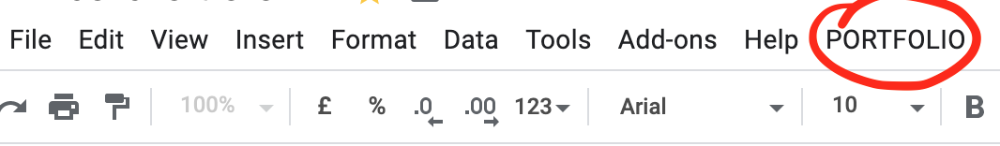
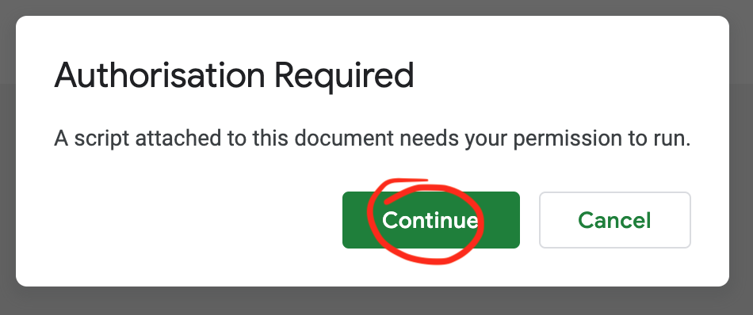
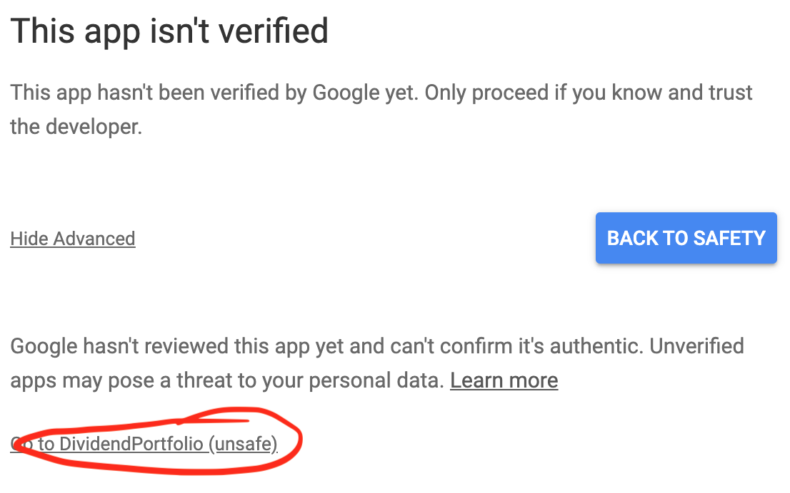
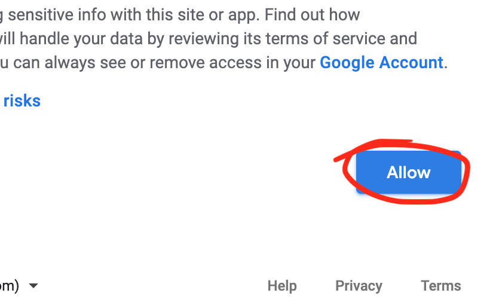
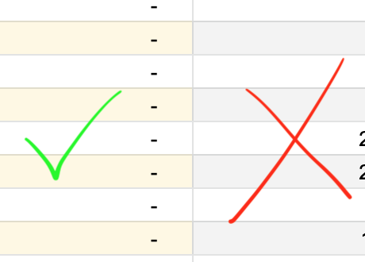

# Ultimate Dividend Portfolio Spreadsheet
:moneybag: Ultimately an essential - powerful  - easy to use - dividend portfolio sheet. :moneybag:

## :beginner: Features

1. It's extremely easy to use and easy for the eyes (or at least intended to). Add your transactions and :boom:

1. It's 100% free! No subscriptions and no sign-ups.

1. Use and buy at any currency.

1. **Wish List**
    - Add the ticker and the value you wish to sell or buy and track if your wish came true with detailed information.

1. **Portfolio - Portfolio Summary - Sectors Summary**
    - All the information you need about all stocks in your portfolio.

1.  **Transactions - Transactions Summary**
    - This is where the magic lives. Add your transaction and track your actions.
    - Find by date range or stock.

1. **Dividend Income - Dividend Income Summary**
    - Add the dividends you've received and track them in the summary.
    - Find by date range, stock or type.
    - Great for tracking dividend growth.

## :beginner: Getting a copy

1. Make a copy of the spreadsheet.
    If sharing, bookmarking or saving the link. Use [this GitHub page](https://srmarquinho.github.io/ultimate-dividend-portfolio/) as the copy link may likely change overtime.

    [Here is an example with my own portfolio for reference](https://docs.google.com/spreadsheets/d/11TTXusLRZ4FY0hlNKK0wxT6kyhfAZi5dP8sACWZaauA/edit?usp=sharing)

    [**Here is the blank template you need to make a COPY**](https://docs.google.com/spreadsheets/d/1bKsZjc8phniiR7NSL_pzfpgbLte4eVXMxAm57KPmLdA/copy?usp=sharing) - this will create a copy to yourself on Google Drive!!!

1. Install and authorize scripts. That's necessary to give scripts access to your sheets. You will only need to do this once.

> Don't worry. This is open source. Google just wants to ensure you are aware a script will run.

  - In the top menu click "PORTFOLIO" > "About"

--

--

--

- Reload the page. If you see the sidebar you are set. The sidebar is where you can stay up to date with any update.

## :beginner: Instructions

1. Check _"Settings"_ sheet tab and choose your currency.

1. Cells you **should** change and add your own values are light or dark **YELLOW(ish)**.

    :warning: **DO NOT edit any other cell**. Everything else is automatically populated.

    

1. That's all! You are ready. Start adding _"Transactions"_ to see the magic happen.
    - Ensure `-` are actually `0`.
    - You can add one transaction per stock with the average value paid if that's preferable by you.

- **NOTE: If you are updating from beta.**
  - Copy and paste all yellowish cells and paste in the new sheet. (right click `Paste special` > `Paste values only`)
  - From the _Overrides_ section note that "Forward dividend" is no longer in use and the column has been deleted.

### Tooltips

- Check for tooltips by hovering over the first row cells.
- I encourage you to chase tooltips ;D

### _Overrides_ - (Missing stock data in the "Portfolio")

- This is optional.
- At times "the provider" may not have the information for the ticker you entered. Showing N/A.
- Again, **DO NOT edit any grey cell** in the "Portfolio", if you do it may brake the auto-populate.
- Instead use the tab _"Overrides"_ to enter the missing information you need.

### Sorting

- Sorting is one of the best features and it has being kept in mind during development.
- Order doesn't matter, all entries can be added in any order. A striped triangle in the first row can be used for re-ordering. For instance, you can order the "Portfolio" by name. My preferred way is by weight (Sort Z - A).
- In the _"Portfolio"_ section you can also drag and drop columns and rows to re-order (just don't delete them). How cool is that?
- Why not trying to sort by "Sectors", "Return %" or "Ex-dividend day"? ;)

### Currency

- Once your "home" currency is chosen in the _"Settings"_, it should not be changed as it will be used for exchange based on the value added in _"Transactions"_.
- Tip: In _"Transactions"_ your "home" currency exchange value will always be 1.

### Tips

**Find:** You can use `ctrl f` (`cmd f` on mac) to find for keywords in your sheet.

**Too big:** Use `ctrl -` (`cmd -` on mac) to zoom out.

**Too small:** Use `ctrl +` (`cmd +` on mac) to zoom in.

**Hundreds of transactions to add:** You probably be alright adding the average price you paid for each stock. Unless you want a detailed summary.

## "#ERROR!" or "Loading..." Note

If you see #ERROR! or Loading...

Use the menu at the top:
  - `PORTFOLIO` > `Refresh portfolio calculations` to refresh the cells.
  or try:
  - `PORTFOLIO` > `Refresh data` to retrieve fresh stock data.

They are Google errors and seem to be related to cache. Google caches each cell and sometimes they get stuck. :neutral_face:

Please please please. Do not email me reporting these errors.

## Issues and new features

You are welcome to open issues an features here on GitHub.

:children_crossing: Just keep in mind I'm a busy dad full time worker and it may take some time for your wish to come true.

------------------

:white_check_mark: **If you follow the rules you should have a smooth experience.**

------------------

And if you found this helpful and appreciate the time put on this sheet, send your love by donating any amount for the kids piggy bank.
By doing this you will be contributing to future updates and features. **THANK YOU!** :kissing_smiling_eyes:

<a href="https://paypal.me/srmarquinho">https://paypal.me/srmarquinho</a>

  
  Bitcoin: 3MTkTrPT5M4GDoc8z8SW7iPc5Vu7s76QSH

------------------

Trading 212 is the platform I use. It's commission free.

**Do you want to get a free stock share worth up to £100?**

Create a Trading 212 Invest account using this link [www.trading212.com/invite/FMJUCzLD](www.trading212.com/invite/FMJUCzLD) and we both get a free share!"

------------------

> :link: https://www.linkedin.com/in/srmarquinho/
